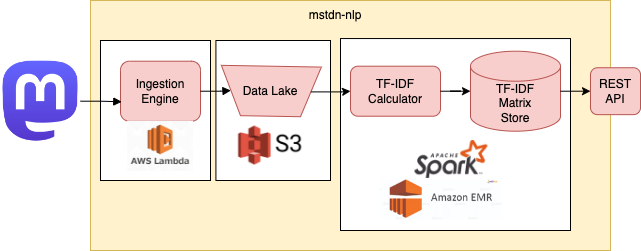

# Inside Mastodon: NLP Analysis with Spark

This project implements a robust data pipeline for analyzing Mastodon toots, utilizing Apache Spark (with PySpark for Python integration) and Apache Hadoop. Designed for local and cloud (AWS Lambda) environments, it leverages Docker for seamless operation.



*Figure 1: Architecture of the Mastodon toot analysis pipeline.*

## Quick Start
Run `docker-compose up` to activate the system. This command initiates the Mastodon toot extractors, the TF-IDF matrix calculation via the REST API, and provides recommendations for Mastodon users to follow based on keyword input.

## Components

### Toot Extractor
This Docker service, named `extractor`, periodically fetches public timelines from Mastodon servers and stores the data into a data lake.

#### Features:
- Fetches the public timeline from Mastodon servers (e.g., `mastodon.social`).
- Performs data retrieval every 30 seconds.
- Efficiently structures data for easy Spark loading.

### TF-IDF Matrix Calculation
A PySpark application that processes data from the data lake to compute a TF-IDF matrix, stored as a Parquet file in the `warehouse` volume.

#### Features:
- Generates a matrix with rows representing Mastodon users and columns representing vocabulary words.
- Recalculates the TF-IDF matrix every 5 minutes.

### REST API
This interface exposes the system's analytical capabilities, facilitating user relationship analysis on Mastodon.

#### Endpoints:
- `/api/v1/accounts/`: Lists Mastodon accounts with usernames and IDs.
    ```
    [
        {
            "username": "dahlia",
            "id": "109246474478239584"
        },
        {
            "username": "retrohondajunki",
            "id": "109940330642741479"
        },
        ...
    ]
    ```
- `/api/v1/tf-idf/user-ids/<user_id>`: Retrieves the TF-IDF matrix row for a specific user.
- `/api/v1/tf-idf/user-ids/<user_id>/neighbors`: Returns the 10 nearest neighbors based on cosine-distance in the TF-IDF matrix.

## Scalability
Enhance processing power by increasing worker containers:

```
docker-compose scale spark-worker=6
```
